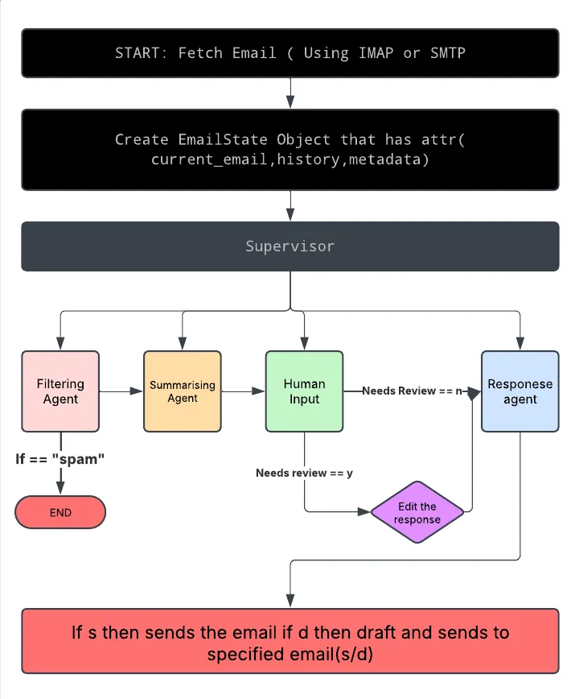

## Project Overview
We are building an AI-powered email agent that:

- Fetches emails in real-time.
- Classifies them into Spam, Urgent, Needs Review, and Informational categories.
- Generates a summary for each email.
- Uses the summary to craft an appropriate response.
- Sends or drafts the response as per user input.

While the Deepseek API is a crucial component, we also require other tools to build this system. The three major tools used are LangChain, LangGraph, and IMAP servers.

## LangGraph
 provides a structured, directed graph framework where each node represents a specific task — filtering, summarizing, or generating responses. The edges define how data flows between these nodes.It supports dynamic routing, meaning it can apply conditional logic to determine the next step. For example, if an email is classified as spam, the pipeline can automatically terminate further processing, ensuring efficiency.

## LangChain
  simplifies the creation of LLM-powered applications by enabling a modular approach. Each component in our pipeline — such as summarization or response generation — is a discrete module. These modules are orchestrated seamlessly, ensuring smooth data flow and easy maintenance.

## IMAP
 allows our system to connect to a remote email server, authenticate the user, and fetch emails for processing. It supports both real-time email retrieval and loading JSON-based test data.

 

1. Start: Fetch Emails
- Emails are retrieved live using IMAP or loaded from a JSON file for testing and development.

2. Create EmailState Object
- Initializes an object that tracks the current email, maintains a history of processing steps, and stores metadata.
- Serves as a container for all data flowing through the pipeline.

3. Filter Node
- Analyzes the email’s subject and body.
- Classifies emails as Spam, Urgent, Informational, or Needs Review.
- If marked as spam, the pipeline terminates early to optimize resource usage.

4. Summary Node
- Generates a brief summary of the email content.
- Passes the summary to the response node for processing.

5. Response Node
- Uses the summary and other email details to craft a suitable reply.
- Generates an initial auto-response based on the email’s context.

6. Human Review Node
- If the generated response is uncertain or flagged for review, the user can manually edit or refine it.

7. IMAP Integration
- Fetches emails from the IMAP server in real time or loads test data from JSON.
- Supports selective email retrieval to ensure smooth pipeline execution.

8. Send or Draft Decision
- The user chooses whether to send the response immediately or save it as a draft.
- If sending:
— The email is dispatched via SMTP.
- If drafting:
— The response is saved and optionally forwarded to a Gmail address.

9. Finish: All Emails Processed
- Marks the end of the pipeline after processing a batch of emails.
- Confirms all actions have been logged.


### Setup

1. **Clone the repository:**

   ```bash
   git clone https://github.com/whothefisyash/chatwithemail.git
   cd your-repo-name
   ```

2. **Create and activate a virtual environment (recommended):**

   ```bash
   python -m venv venv
   source venv/bin/activate  # On Windows: venv\Scripts\activate
   ```

3. **Install the dependencies:**

   ```bash
   pip install -r requirements.txt
   ```

## Configuration

The application requires several configuration settings (such as API keys and email server credentials). Create a `.env` file in the project root with the following variables:

```dotenv
# Deepseek API
DEEPSEEK_API_KEY=your_deepseek_api_key

# SMTP Settings
EMAIL_SERVER=smtp.yourserver.com
EMAIL_USERNAME=your_email@example.com
EMAIL_PASSWORD=your_email_password
EMAIL_PORT=587  # Or your SMTP port

# IMAP Settings (defaults to Gmail settings if not provided)
IMAP_USERNAME=your_imap_username
IMAP_PASSWORD=your_imap_password
IMAP_SERVER=imap.gmail.com
IMAP_PORT=993
```

Adjust the values as needed for your environment and email provider.

## Usage

To run the main email processing application, simply execute:

```bash
python main.py
```

### What to Expect

1. **Fetching Emails:**  
   The app will retrieve emails from your IMAP server (or simulate using `sample_emails.json` if configured for simulation).

2. **Email Processing:**  
   Each email is passed through a state graph workflow:
   - **Filtering:** Classifies the email (e.g., spam, urgent, informational, needs review).
   - **Summarization:** Generates a short summary of the email content.
   - **Response Generation:** Drafts a reply. If the response is uncertain or flagged for review, it prompts for human intervention.

3. **Sending/Drafting:**  
   You’ll be prompted to send the email or save it as a draft (which will be sent via SMTP to your specified Gmail address).

## Directory Structure

```plaintext
.
├── agents
│   ├── filtering_agent.py           # Email classification using LLMs
│   ├── human_review_agent.py        # Allows manual review of generated responses
│   ├── response_agent.py            # Generates email replies
│   ├── summarization_agent.py       # Summarizes email content
│   └── __init__.py
├── config.py                        # Loads configuration and environment variables
├── core
│   ├── email_imap.py                # IMAP integration for fetching live emails
│   ├── email_ingestion.py           # Simulated email ingestion (JSON file)
│   ├── email_sender.py              # SMTP integration for sending emails
│   ├── state.py                     # Definition of the EmailState dataclass
│   ├── supervisor.py                # Coordinates the state graph workflow
│   └── __init__.py
├── drafts
│   └── Schedule.txt                 # Example draft email file
├── email.sh                       # Shell script for email tasks (if needed)
├── hello.md                       # Additional project notes or demo info
├── hhhhhh.jpg                     # Project image (e.g., logo)
├── main.py                        # Main entry point for the application
├── Python Script COmbined for ipynb.py  # Combined script from a Jupyter Notebook
├── README.md                      # This documentation file
├── requirements.txt               # Python dependencies
├── sample_emails.json             # Simulated email data for testing/demo
├── sample.ipynb                   # Jupyter Notebook with code examples
├── test_email.py                  # Unit tests for email processing functionalities
└── utils
    ├── formatter.py               # Utility functions for formatting emails
    ├── logger.py                  # Logger configuration and setup
    └── __init__.py
```

